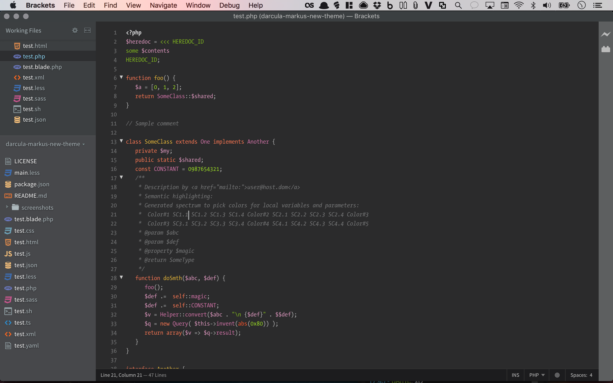
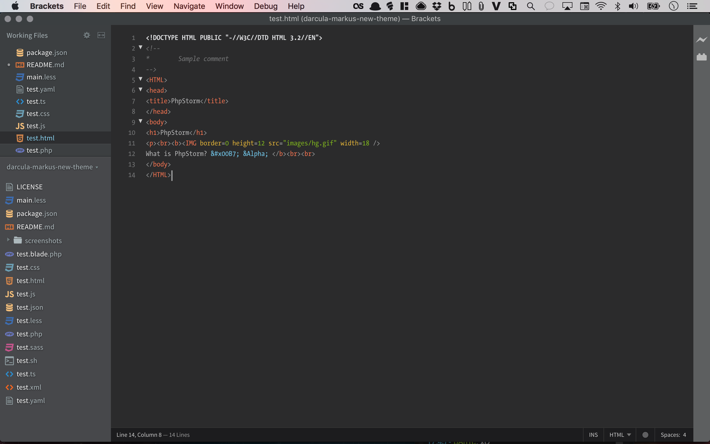
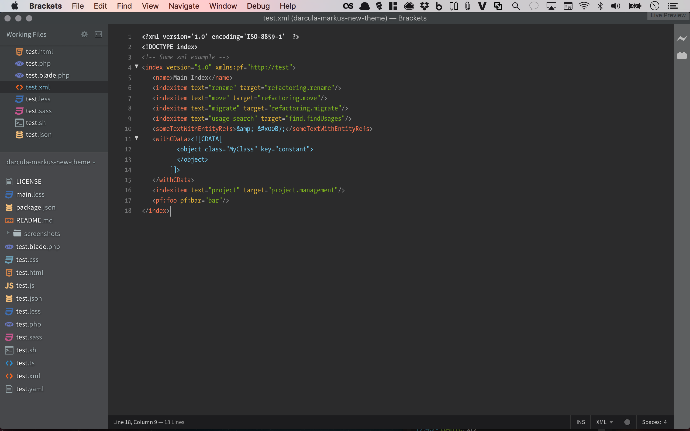
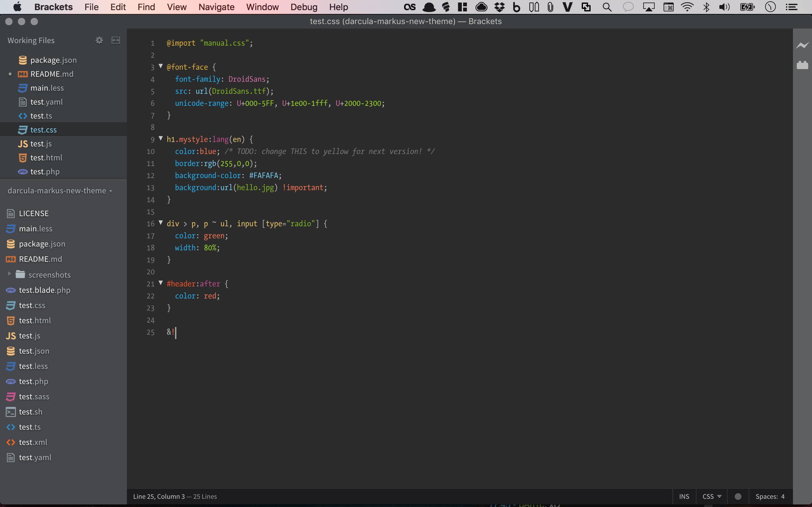
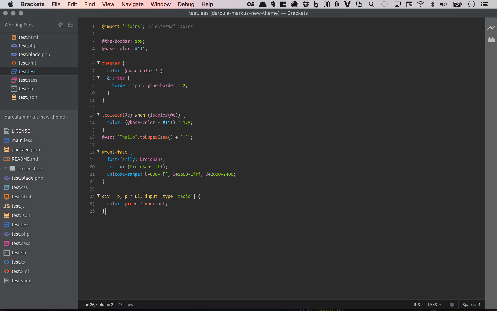
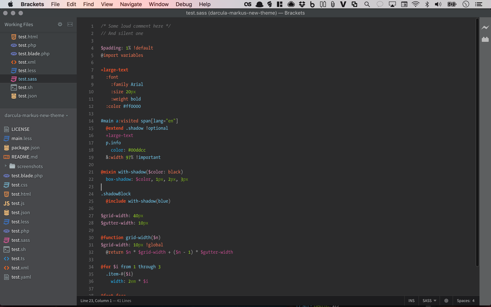
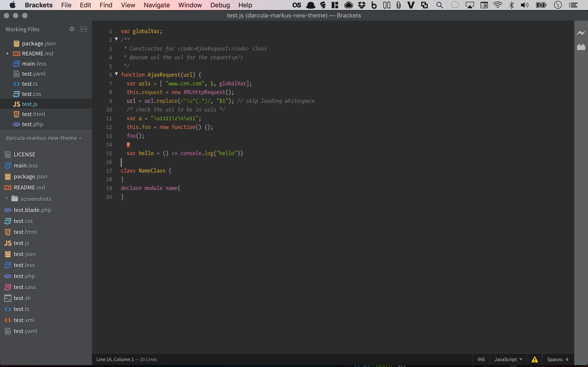
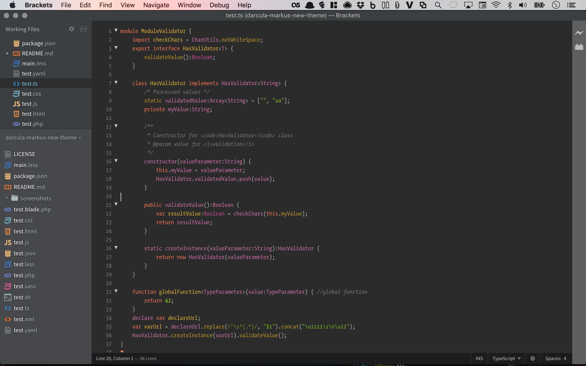
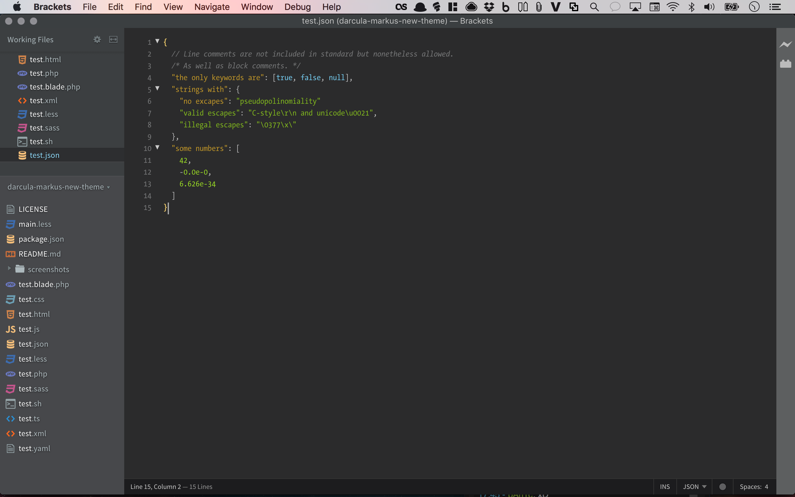
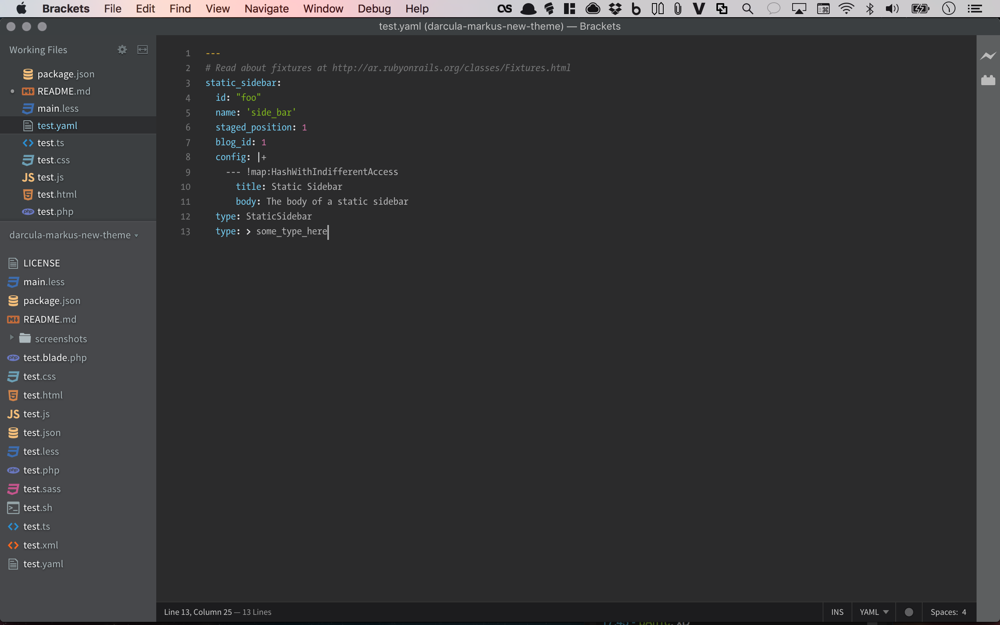

Brackets Theme: Fabian Dark
===
directory = (C:\Users\desbog7\AppData\Roaming\Brackets\extensions\user\fabian-dark-theme).

This theme is based on _TheSansMono_ _Condensed_ by [LucasFonts](http://www.lucasfonts.com/fonts/thesansmono/thesansmono-condensed/overview/).

Screenshots
---

### PHP

### HTML

### XML

### CSS

### LESS

### SASS

### JavaScript

### TypeScript

### JSON

### YAML

Installation
---

This extension requires Brackets Release 1.1 or newer.

1. Open Brackets
2. Open the Extension Manager
3. Switch to "Themes" tab
4. Search for "Markus New Theme"
5. Click "Install"

Recommended Extensions 
---
1.  <a href="https://github.com/artem-solovev/anode" target="_blank">Anode.</a>
2. <a href="https://github.com/mikaeljorhult/brackets-autoprefixer" target="_blank">Autoprefixer.</a>
3. <a href="https://github.com/martypenner/brackets-autosave-files-on-window-blur" target="_blank">Autosave Files on Window Blur.</a>
4. <a href="https://github.com/brackets-beautify/brackets-beautify" target="_blank">Beautify.</a>
5. <a href="https://github.com/mirorauhala/brackets-bootstrap-skeleton" target="_blank">Bootstrap Skeleton.</a>
6. <a href="https://github.com/sprintr/brackets-color-palette" target="_blank">Brackets Color Palette.</a>
7. <a href="https://github.com/Armacryss/brackets-utf8-converter" target="_blank">Brackets Extension - UTF8 converter.</a>
8. <a href="https://github.com/zaggino/brackets-git" target="_blank">Brackets Git</a>
9. <a href="https://github.com/chuyik/brackets-snippets" target="_blank">Brackets Snippets (by edc).</a>
10. <a href="https://github.com/mskocik/brackets-tree-icons" target="_blank">Brackets Tree Icons.</a>
11. <a href="https://github.com/fdecampredon/brackets-typescript" target="_blank">Brackets TypeScript</a>
12. <a href="https://github.com/bomsy/brackets-compare" target="_blank">brackets-compare.</a>
13. <a href="https://github.com/Brackets-Themes/DarkSoda" target="_blank">DarkSoda.</a>
14. <a href="https://github.com/dracula/brackets" target="_blank">Dracula Official.</a>
15. <a href="https://emmet.io/" target="_blank">Emmet.</a>
16. <a href="https://github.com/lkcampbell/brackets-indent-guides" target="_blank">Indent Guides.</a>
17. <a href="https://github.com/ahuth/brackets-indentator" target="_blank">Indentator.</a>
18. <a href="https://github.com/ForbesLindesay/jade-brackets" target="_blank">Jade (Official Plugin).</a>
19. <a href="https://github.com/cfjedimaster/brackets-jshint" target="_blank">JSHint.</a>
20. <a href="https://github.com/konstantinkobs/brackets-LESShints" target="_blank">LESSHints.</a>
21. <a href="https://github.com/Brackets-Themes/Monokai" target="_blank">Monokai.</a>
22. <a href="https://github.com/ahuth/brackets-paste-and-indent" target="_blank">Paste and Indent.</a>
23. <a href="https://github.com/DH3ALEJANDRO/custom-work-for-brackets" target="_blank">Pestañas - Trabajando Comodamente.</a>
24. <a href="https://github.com/cheesypoof/QuickDark" target="_blank">Quick Dark.</a>
25. <a href="https://github.com/maximmis/brackets-SASShints" target="_blank">SASS/SCSS Hints</a>
26. <a href="https://github.com/FreaKzero/brackets-swatcher" target="_blank">Swatcher.</a>
27. <a href="https://github.com/zaggino/brackets-typescript" target="_blank">TypeScript.</a>
28. <a href="https://github.com/fergaldoyle/brackets-visual-studio-dark" target="_blank">Visual Studio Dark</a>

